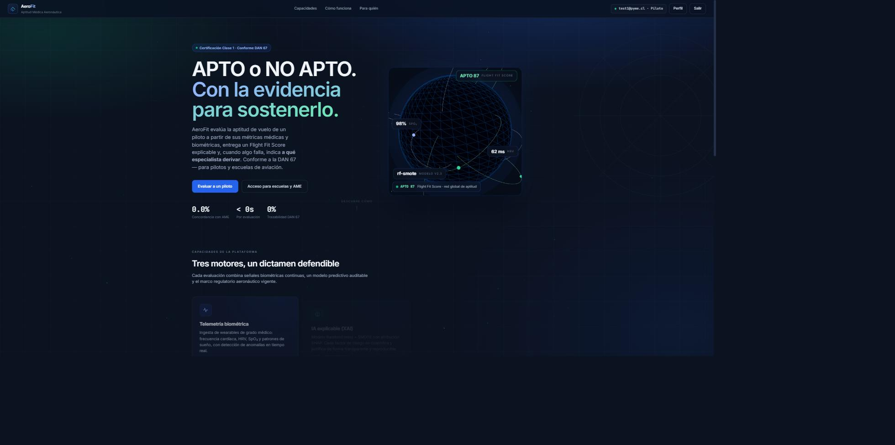
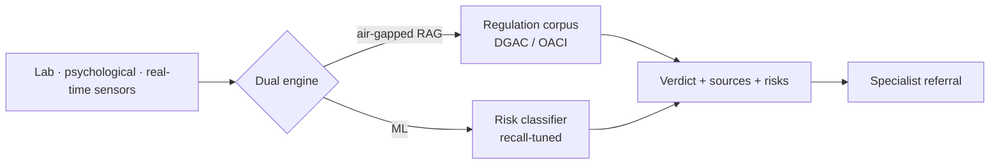

# AeroFit — Aeromedical Fitness Evaluation
> Source-grounded AI that decides whether a pilot is fit to fly — with a traceable verdict, not a black box.

  🚀 <a href="https://aero-fit-eight.vercel.app"><b>Live demo</b></a>

## The problem

Aeromedical fitness decisions carry legal and clinical consequence: a wrong "fit" can put a pilot in a cockpit who shouldn't be there. Most ML systems answer with a score and no justification — AeroFit answers with a verdict **and its sources**.

## What it does

Ingests lab results, psychological exams and real-time sensor signals (blood pressure, heart rate, oxygenation), reasons over a dataset built from national and international aeronautical and medical regulation, and returns a **fit / fit-with-restrictions / unfit** verdict with its sources, risks, justification and specialist referral. Tuned to **0.65 recall on the risk class** — a missed risk costs more than a false alarm. Human-in-the-loop by design: it refers to a specialist even when the verdict is "fit," and the pilot controls deletion of their own data.

## Architecture

## Results & impact

- **0.65 recall** on the risk class (safety-first tuning)
- 6 phases from research to validation
- Final-year engineering capstone

## Stack

Python · RAG · Ollama · scikit-learn · real-time sensor ingestion

## Source & access

Private (product IP). Happy to walk through the architecture or grant **read-only access on request**.
Open technical core: [Medical-Aeronautic RAG Engine](https://github.com/akhanER2000/Local-RAG-medical-assistance-aeronautic).

**Contact:** [Portfolio](https://cs-portfolio-psi-topaz.vercel.app) · [LinkedIn](https://www.linkedin.com/in/akhan-espinoza) · castrolorenzosegundo@gmail.com

---
Docs © 2026 Akhan Lorenzo Espinoza Rojas — All rights reserved.
